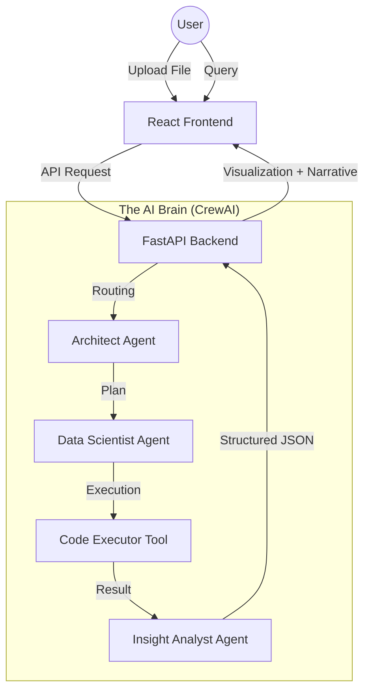

# 📊 DataViz AI: Intelligence-Driven Data Visualization

[](https://www.python.org/)
[](https://react.dev/)
[](https://fastapi.tiangolo.com/)
[](https://www.crewai.com/)
[](https://aistudio.google.com/)

**DataViz AI** is a premium, full-stack analytical platform that transforms raw datasets (CSV/Excel) into deep business narratives and stunning interactive visualizations. Unlike traditional BI tools, it uses a **Hybrid 3-Agent "Brain"** to reason about your data, verify schemas, and synthesize human-like insights.

---

## ✨ Key Features

- 🧠 **Hybrid 3-Agent Pipeline**:
  - **The Architect**: Strategies and verifies schema mappings.
  - **The Data Scientist**: Writes and executes high-performance Python code.
  - **The Insight Analyst**: Synthesizes multi-paragraph business narratives.
- 🎨 **Premium Dark UI**: A sleek, glassmorphic interface inspired by modern design systems.
- 📈 **Autonomous Visualization**: Automatically generates Plotly charts based on natural language intent.
- 📂 **Multi-Format Support**: Instantly process and analyze `.csv`, `.xlsx`, and `.xls` files.
- 💬 **Semantic Routing**: Intelligently identifies if a query needs a quick stat or a deep analytical "Deep Dive."

---

## 🛠️ Tech Stack

| **Layer** | **Technologies** |
| :--- | :--- |
| **Frontend** | React 18, Vite, Axios, Lucide Icons, Vanilla CSS (Glassmorphism) |
| **Backend** | FastAPI, Pandas, Plotly, Uvicorn |
| **AI "Brain"** | CrewAI, Gemini 3.1 Flash/Pro, LiteLLM |
| **DevOps** | Python-Dotenv, Git, Pycache Management |

---

## 🏗️ Architecture



---

## 🚀 Getting Started

### 1. Prerequisites
- Python 3.9+
- Node.js 18+
- A [Gemini API Key](https://aistudio.google.com/app/apikey)

### 2. Installation

**Clone the repository:**
```bash
git clone https://github.com/your-username/aiviz.git
cd aiviz
```

**Set up the Backend:**
```bash
cd backend
pip install -r requirements.txt
cp .env.example .env
# Edit .env and add your GEMINI_API_KEY
python main.py
```

**Set up the Frontend:**
```bash
cd ../frontend
npm install
npm run dev
```

---

## 📖 How to Use

1. **Upload**: Drag and drop your `.csv` or `.xlsx` file into the central upload area.
2. **Explore**: View the high-density data preview to verify your columns.
3. **Analyze**: Ask complex questions in the chat sidebar.
   - *Example*: "Why are sales trending down in the East region?"
   - *Example*: "Show me the relationship between Date and Trading Volume."
4. **Export**: Interact with the generated Plotly charts and copy insights for your reports.

---

## 🤝 Contributing

Contributions are welcome! Please feel free to submit a Pull Request.

1. Fork the Project
2. Create your Feature Branch (`git checkout -b feature/AmazingFeature`)
3. Commit your Changes (`git commit -m 'Add some AmazingFeature'`)
4. Push to the Branch (`git push origin feature/AmazingFeature`)
5. Open a Pull Request

---

## 📜 License

Distributed under the MIT License. See `LICENSE` for more information.

---
Built with ❤️ by [Your Name/Handle]
